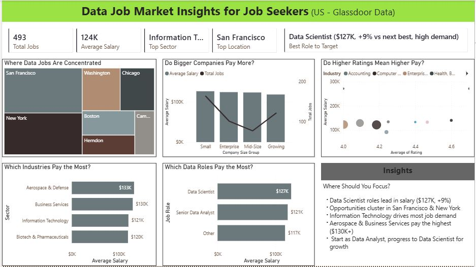

# US Data Job Market Analysis (Power BI)

## 📊 Overview
This project analyses the US data job market using Glassdoor data, focusing on job demand, salary trends, and hiring patterns.

## 🎯 Objective
To identify which data roles offer the best opportunities based on salary and demand.

## 🛠 Tools Used
- Power BI
- Power Query
- DAX

## 🔍 Key Insights
- Data Scientist roles offer the highest average salary ($127K)
- Job opportunities are concentrated in San Francisco and New York
- Industry plays a major role in salary variation

## 📁 Files
- Dashboard (.pbix)
- Dataset (CSV)

## 📸 Dashboard Preview

## 🚀 What I Learned
- Data cleaning and transformation using Power Query
- Creating dynamic KPIs using DAX
- Designing dashboards for decision-making
